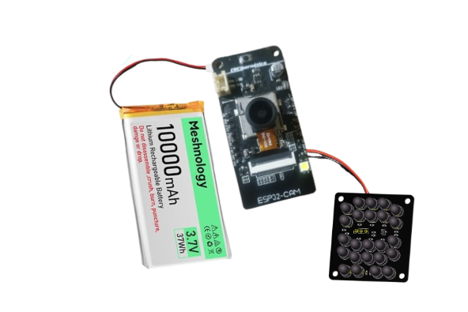
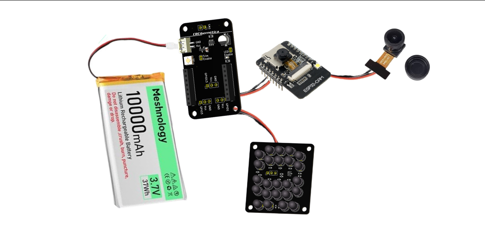
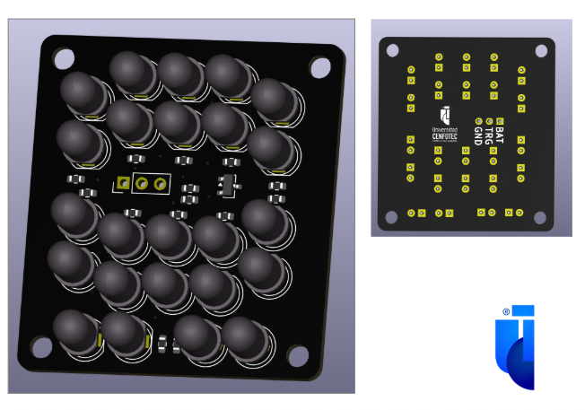
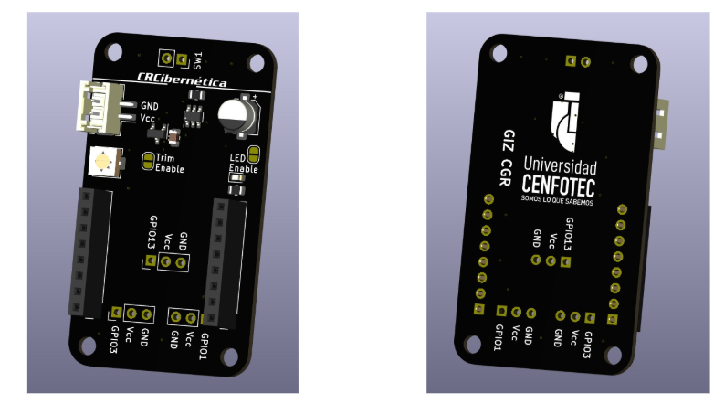
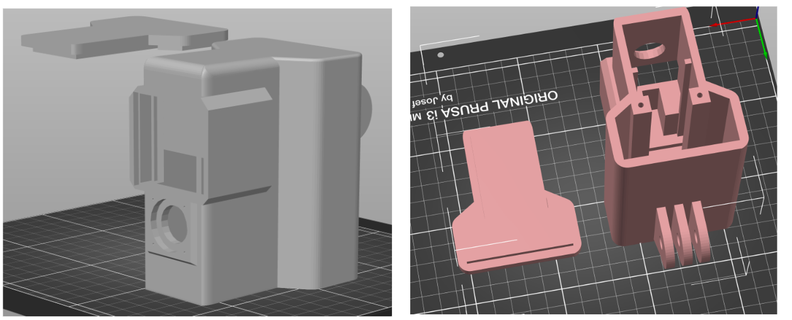
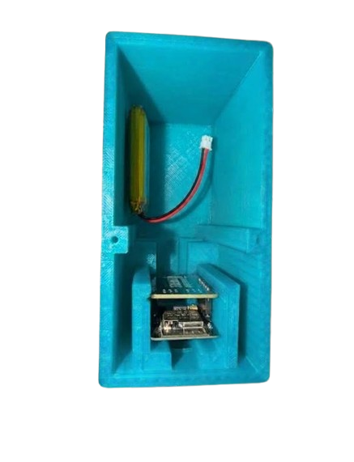
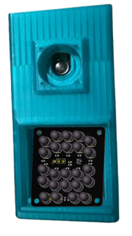

# Croc Alert – Prototipo 5

Guía técnica de **programación, preparación electrónica, soldadura, ensamblaje y puesta en funcionamiento** del Prototipo 5 de Croc Alert.

---

## 1. Descripción

El Prototipo 5 es una evolución del sistema Croc Alert orientada a mejorar la captura de imágenes en condiciones de baja iluminación y a integrar todos los componentes electrónicos dentro de una carcasa más compacta.

Esta versión incorpora una **ESP32-CAM**, una cámara con lente para visión nocturna, una placa personalizada de **24 LED infrarrojos de 850 nm**, una placa de control CRCibernetica, un sistema de alimentación mediante baterías y una carcasa diseñada para integrar el conjunto.

El diseño del Prototipo 5 también incorpora una modificación de la placa temporizadora para añadir un puerto lógico y permitir que los LED sean controlados desde la ESP32.

---

## 2. Objetivos del Prototipo 5

El desarrollo de esta versión busca:

- Mejorar la iluminación en condiciones nocturnas.
- Integrar una mayor cantidad de LED infrarrojos.
- Utilizar iluminación infrarroja de 850 nm.
- Controlar la iluminación desde la ESP32.
- Reducir el tamaño de la solución mediante una carcasa más compacta.
- Integrar cámara, iluminación, control y alimentación en un solo dispositivo.
- Proteger el sistema frente a la humedad interna mediante material absorbente.

---


La iluminación infrarroja es controlada desde la ESP32 mediante la electrónica de control del prototipo.

### Circuito general

La siguiente imagen muestra cómo queda el circuito una vez realizadas las conexiones, soldado y ensamblado de todos sus componentes. Esta configuración corresponde al montaje final del sistema **antes de ser instalado dentro del case**, permitiendo visualizar la distribución y conexión de los componentes electrónicos.



---

## 3. Componentes

### 3.1 Componentes electrónicos

| Componente | Función |
|---|---|
| ESP32-CAM | Control principal y ejecución del programa |
| Cámara | Captura de imágenes |
| Módulo programador | Programación temporal de la ESP32-CAM |
| Placa CRCibernetica | Integración y control electrónico |
| Placa de LED IR | Iluminación infrarroja |
| 24 LED IR 850 nm | Iluminación en condiciones nocturnas |
| 2 baterías de 10 000 mAh | Alimentación del prototipo |
| Cables | Interconexión eléctrica |
| Tampox | Absorción de humedad dentro de la carcasa |

### 3.2 Componentes mecánicos

- Carcasa del Prototipo 5.
- Soporte de cámara.
- Soporte de la placa de LED.
- Espacios internos para electrónica y batería.
- Elementos de fijación.

### 3.3 Vista general de los componentes



---

## 4. Herramientas necesarias

- Computadora.
- Cable USB.
- Módulo programador para ESP32-CAM.
- Cautín.
- Estaño.
---

## 5. Reglas importantes antes de comenzar

> [!WARNING]
> **La batería se conecta de último.**
>
> La batería debe permanecer desconectada durante la programación, la soldadura y el montaje inicial.

Antes de energizar el sistema:

- Revisar todas las soldaduras.
- Comprobar polaridad.
- Verificar continuidad.
- Descartar cortocircuitos.
- Comprobar que los cables no estén atrapados o tensionados.

---

# 6. Proceso general

El armado completo debe seguir este orden:

```text
1. Preparar componentes
        ↓
2. Conectar cámara a ESP32-CAM
        ↓
3. Colocar ESP32-CAM en módulo programador
        ↓
4. Programar
        ↓
5. Probar ESP32-CAM
        ↓
6. Desconectar del módulo programador
        ↓
7. Soldar TODOS los componentes
        ↓
8. Revisar soldaduras
        ↓
9. Preparar la carcasa
        ↓
10. Introducir primero la placa de LED
        ↓
11. Introducir la cámara
        ↓
12. Colocar Tampox
        ↓
13. Conectar la batería
        ↓
14. Cerrar la carcasa
        ↓
15. Realizar pruebas finales
```

El orden físico más importante es:

**LED → cámara → Tampox → batería.**

---

# 7. Etapa 1 – Preparación de la ESP32-CAM

## 7.1 Conectar la cámara

1. Tomar la ESP32-CAM.
2. Localizar el conector de la cámara.
3. Insertar cuidadosamente el cable flex.
4. Verificar que la orientación sea correcta.
5. Cerrar el seguro del conector.
6. Comprobar que la conexión quede firme.


> No forzar el cable flex ni el conector de la cámara.

---

## 7.2 Colocar la ESP32-CAM en el módulo programador

La ESP32-CAM se utiliza inicialmente conectada al módulo programador para cargar el firmware y realizar las primeras pruebas.

1. Alinear los pines de la ESP32-CAM con el módulo programador.
2. Insertar cuidadosamente la ESP32-CAM.
3. Conectar el módulo programador a la computadora mediante USB.
4. Identificar el puerto COM asignado por el sistema operativo.

En esta etapa la ESP32-CAM **todavía no se instala dentro de la carcasa**.

---

# 8. Programación con PlatformIO

PlatformIO se puede utilizar como entorno principal para compilar y cargar el programa de la ESP32-CAM.

## 8.1 Preparar el entorno

1. Instalar Visual Studio Code.
2. Instalar la extensión PlatformIO IDE.
3. Abrir Visual Studio Code.
4. Abrir el proyecto de Croc Alert.
5. Esperar a que se descarguen o reconozcan las dependencias del proyecto.

## 8.2 Estructura recomendada del proyecto

```text
CrocAlert/
├── src/
│   └── main.cpp
├── include/
├── lib/
├── platformio.ini
└── README.md
```

## 8.3 Revisar `platformio.ini`

El archivo `platformio.ini` define la plataforma, la placa y el framework utilizados por el proyecto.

Ejemplo general:

```ini
[env:esp32cam]
platform = espressif32
board = esp32cam
framework = arduino

monitor_speed = 115200
```

> La configuración debe coincidir con el modelo exacto de ESP32-CAM utilizado.

## 8.4 Compilar

Antes de cargar el código:

1. Abrir PlatformIO.
2. Ejecutar **Build**.
3. Esperar a que termine la compilación.
4. Confirmar que no existan errores.

## 8.5 Seleccionar el puerto

Conectar el módulo programador y seleccionar el puerto COM que corresponda a la ESP32-CAM.

Ejemplo:

```text
COM3
COM5
COM11
```

El número cambia según la computadora.

## 8.6 Cargar el programa

Ejecutar:

```text
PlatformIO → Upload
```

Esperar a que finalice la carga del firmware.

## 8.7 Verificar la carga

Confirmar que el proceso termine sin errores y que la ESP32-CAM pueda iniciar el programa.

---

# 9. Programación con Arduino IDE

Arduino IDE puede utilizarse como alternativa para programar la ESP32-CAM.

## 9.1 Instalar soporte para ESP32

1. Abrir Arduino IDE.
2. Ir a **Archivo → Preferencias**.
3. Agregar la URL correspondiente al gestor de tarjetas de ESP32.
4. Ir a **Herramientas → Placa → Gestor de tarjetas**.
5. Buscar e instalar el soporte para ESP32.

## 9.2 Seleccionar la placa

Seleccionar la tarjeta correspondiente al hardware utilizado.

En caso de utilizar una AI Thinker ESP32-CAM:

```text
AI Thinker ESP32-CAM
```

## 9.3 Seleccionar el puerto

Ir a:

```text
Herramientas → Puerto
```

Seleccionar el puerto COM de la ESP32-CAM.

## 9.4 Cargar el código

1. Abrir el código del proyecto.
2. Compilar.
3. Seleccionar **Upload**.
4. Esperar a que finalice la carga.
5. Probar la ESP32-CAM.

---

# 10. Prueba de la ESP32-CAM antes del montaje

Antes de continuar con el proceso de soldadura, comprobar:

- La ESP32-CAM enciende.
- El programa inicia correctamente.
- La cámara responde.
- La captura de imágenes funciona.
- No existen reinicios inesperados.

> **No continuar con el ensamblaje permanente hasta completar esta prueba.**

---

# 11. Etapa 2 – Desconectar del módulo programador

Cuando la programación y las pruebas hayan finalizado:

1. Desconectar el cable USB.
2. Retirar cuidadosamente la ESP32-CAM del módulo programador.
3. Colocar la ESP32-CAM en una superficie segura.
4. Mantener la batería desconectada.
5. Preparar los componentes para la soldadura permanente.

A partir de aquí comienza el ensamblaje definitivo del dispositivo.

---

# 12. Etapa 3 – Soldadura de todos los componentes

## Regla principal

> **TODAS las conexiones deben quedar preparadas y soldadas antes de introducir los componentes dentro de la carcasa.**


El objetivo de esta etapa es dejar listo el sistema electrónico completo antes de comenzar el montaje físico.

---

# 13. Placa de LED infrarrojos

La placa de iluminación está diseñada para integrar **24 LED infrarrojos de 850 nm**. Para su funcionamiento, la placa cuenta con tres puntos de conexión que permiten conectarla directamente con la placa temporizadora.



## 13.1 Puntos de conexión

La placa de LED infrarrojos dispone de tres puntos de conexión identificados como:

- **GND:** conexión a tierra.
- **BAT:** alimentación proveniente de la batería.
- **TRI:** señal de activación de la iluminación.

Estos tres puntos deben conectarse a los respectivos puntos de la **placa temporizadora**.

La correspondencia de las conexiones es la siguiente:

| Placa de LED | Placa temporizadora |
|---|---|
| **GND** | **GND** |
| **BAT** | **VCC** |
| **TRI** | **GPIO13** |

De esta manera, la placa temporizadora proporciona la alimentación y la señal de control necesarias para activar la iluminación infrarroja.

## 13.2 Preparación

1. Colocar la placa sobre una superficie estable.
2. Identificar los tres puntos de conexión: **GND, BAT y TRI**.
3. Preparar tres cables de conexión.
4. Pelar los extremos de los cables.
5. Estañar los extremos de los cables y los puntos de soldadura cuando sea necesario.

## 13.3 Soldadura

1. Colocar el cable correspondiente en cada punto de conexión.
2. Soldar **GND de la placa de LED con GND de la placa temporizadora**.
3. Soldar **BAT de la placa de LED con VCC de la placa temporizadora**.
4. Soldar **TRI de la placa de LED con GPIO13 de la placa temporizadora**.
5. Dejar enfriar las uniones.
6. Revisar visualmente cada soldadura.
7. Verificar que no existan puentes de estaño ni conexiones sueltas.

---

# 14. Placa temporizadora

La placa temporizadora forma parte del sistema de control e integración electrónica. En el **Prototipo 5** se utiliza una versión modificada de esta placa para incorporar una interfaz lógica que permite controlar la iluminación infrarroja desde la **ESP32**.



## 14.1 Identificación de las conexiones

La placa temporizadora dispone de diferentes puntos de conexión para alimentación, tierra y señal de control. Para la conexión con la placa de LED infrarrojos se utilizan:

- **GND:** conexión a tierra.
- **VCC:** alimentación.
- **GPIO13:** señal de control proveniente de la ESP32.

La conexión con la placa de LED se realiza de la siguiente manera:

| Placa temporizadora | Placa de LED |
|---|---|
| **GND** | **GND** |
| **VCC** | **BAT** |
| **GPIO13** | **TRI** |

## 14.2 Preparación

1. Identificar los puntos **GND, VCC y GPIO13** de la placa temporizadora.
2. Preparar los tres cables que conectarán ambas placas.
3. Pelar los extremos de los cables.
4. Estañar los extremos para facilitar la soldadura.
5. Verificar que cada cable corresponda al punto de conexión indicado en el esquema.

## 14.3 Conexión entre las placas

La conexión final entre ambas placas queda establecida de la siguiente forma:

**Placa de LED → Placa temporizadora**

- `GND → GND`
- `BAT → VCC`
- `TRI → GPIO13`

La señal conectada a **GPIO13** permite que la ESP32 controle la activación de la iluminación infrarroja mediante la placa temporizadora.

> **Importante:** Antes de alimentar el circuito, verificar cuidadosamente la correspondencia de los tres cables para evitar invertir las conexiones de alimentación o señal.
> 
## 15.3 Soldadura

1. Colocar cada cable en el punto correspondiente.
2. Soldar.
3. Esperar a que la unión se enfríe.
4. Inspeccionar la soldadura.
5. Repetir para cada conexión necesaria.

## 15.4 Verificación

Comprobar:
- Soldaduras firmes.
- Ausencia de cortocircuitos.

> Las conexiones definitivas deben seguir el esquema eléctrico del prototipo y no deben inferirse únicamente a partir de las etiquetas visibles.

---

## Procedimiento para cada cable

1. Medir la longitud requerida.
2. Cortar el cable.
3. Pelar el extremo.
4. Estañar.
5. Identificar el punto de conexión.
6. Soldar.
7. Dejar enfriar.
8. Revisar la unión.

---

# 16. Inspección electrónica antes del montaje

Antes de introducir cualquier componente en la carcasa:

### Inspección visual

- Revisar todas las soldaduras.
- Buscar puentes de estaño.
- Buscar cables sueltos.
- Confirmar que no haya componentes dañados.


# 17. Etapa 4 – Preparación de la carcasa

Antes de instalar los componentes:

1. Limpiar el interior de la carcasa.
2. Eliminar residuos de fabricación.
3. Revisar los soportes internos.
4. Identificar la posición de la placa de LED.
5. Identificar la posición de la cámara.
6. Identificar el espacio destinado para la alimentación.



---

# 18. Orden de instalación dentro del case

El orden físico obligatorio es:

```text
1. PLACA DE LED
        ↓
2. CÁMARA
        ↓
3. TAMPOX
        ↓
4. BATERÍA
```

No cambiar este orden durante el ensamblaje.

---

# 19. Instalación de la placa de LED

La **placa de LED se instala primero** dentro de la carcasa.

## Procedimiento

1. Tomar la placa LED ya soldada.
2. Revisar sus conexiones.
3. Introducirla cuidadosamente en la carcasa.
4. Colocarla en su posición de montaje.
5. Asegurar que los LED queden orientados hacia el exterior.
6. Acomodar el cableado.
7. Confirmar que la placa no interfiera con la posición de la cámara.


# 20. Instalación de la cámara

Después de instalar la placa LED, se instala la cámara.

## Procedimiento

1. Tomar la ESP32-CAM ya programada y previamente soldada.
2. Introducirla en la posición correspondiente.
3. Colocar la cámara en su soporte.
4. Orientar el lente hacia el exterior.
5. Verificar que quede centrado.
6. Acomodar el cableado sin forzar el cable flex.
7. Confirmar que la placa de LED no bloquee el campo de visión.

---

# 21. Vista interna del ensamblaje




# 22. Instalación del Tampox

Antes de cerrar la carcasa se coloca el material absorbente de humedad.

El **Tampox** se utilizará dentro del case para ayudar a absorber la humedad acumulada en el interior.

## Procedimiento

1. Preparar el material absorbente.
2. Identificar un espacio libre dentro de la carcasa.
3. Colocar el Tampox en esa zona.
4. Evitar que presione los componentes.
5. Evitar que bloquee la cámara.
6. Evitar que bloquee los LED.
7. Evitar que interfiera con los cables.
8. Comprobar que el case pueda cerrarse correctamente.

> La posición exacta debe mantenerse de forma que no interfiera con ningún componente ni con el cierre de la carcasa.

---

# 23. Conexión de la batería

## ⚠️ LA BATERÍA SE CONECTA DE ÚLTIMO

Este es el último paso eléctrico del montaje.

Antes de conectar la batería deben cumplirse todas estas condiciones:

- Todas las soldaduras están terminadas.
- Todas las conexiones fueron revisadas.
- La placa LED está instalada.
- La cámara está instalada.
- El Tampox está colocado.


## Procedimiento

1. Colocar la batería en su posición.
2. Acomodar el cableado.
3. Conectar la batería.
5. Confirmar el encendido del sistema.


---

# 24. Organización interna final

Antes de cerrar la carcasa verificar:

### Placa LED

- Posición correcta.
- Orientación correcta.
- Cables organizados.

### Cámara

- Lente centrado.
- Sin obstrucciones.
- Cable flex protegido.

### CRCibernetica

- Posicionada correctamente.
- Sin cables sueltos.

### Tampox

- Correctamente ubicado.
- Sin interferencia con los componentes.

### Baterías

- Correctamente ubicadas.
- Conectadas correctamente.
- Sin presión sobre otros componentes.

---

# 25. Cierre de la carcasa

Antes de cerrar:

```text
[ ] LED instalados
[ ] Cámara instalada
[ ] ESP32-CAM instalada
[ ] CRCibernetica instalada
[ ] Todas las soldaduras verificadas
[ ] Cableado organizado
[ ] Tampox colocado
[ ] Batería conectada
[ ] No hay cables atrapados
[ ] No hay componentes sueltos
```

Una vez completada la lista:

1. Colocar la tapa.
2. Alinear las piezas.
3. Cerrar la carcasa.
4. Instalar los elementos de fijación.
5. Revisar visualmente el cierre.

---

# 27. Resultado final

La siguiente fotografía debe mostrar el Prototipo 5 completamente ensamblado.



> Esta imagen se utiliza como referencia visual del resultado final del ensamblaje.

---

# 28. Pruebas finales

## 28.1 Prueba de encendido

Comprobar:

- Encendido del sistema.
- Inicio de la ESP32-CAM.
- Ausencia de reinicios inesperados.

## 28.2 Prueba de cámara

Comprobar:

- Captura de imágenes.
- Orientación.
- Calidad de imagen.

## 28.3 Prueba de iluminación infrarroja

Realizar pruebas con:

- Luz ambiental.
- Poca iluminación.
- Oscuridad.

Verificar que los LED infrarrojos se activen correctamente y que la cámara pueda capturar la escena.

---

# 30. Solución de problemas

## La ESP32-CAM no programa

### Revisar

- Puerto COM.
- Cable USB.
- Módulo programador.
- Placa seleccionada.
- Configuración del proyecto.

## La cámara no funciona

### Revisar

- Cable flex.
- Orientación del cable.
- Conector de la cámara.
- Configuración de cámara en el código.

## Los LED no encienden

### Revisar

- Soldaduras.
- Polaridad.
- Alimentación.
- Señal de control.
- Conexiones entre placas.

## El sistema no enciende

### Revisar

- Baterías.
- Polaridad.
- Soldaduras.
- Continuidad.
- Posibles cortocircuitos.

## La carcasa no cierra correctamente

### Revisar

- Posición de la batería.
- Organización del cableado.
- Posición de la placa LED.
- Posición de la cámara.
- Ubicación del Tampox.

---

# 31. Checklist de armado

## Programación

- [ ] Cámara conectada a la ESP32-CAM.
- [ ] ESP32-CAM colocada en el módulo programador.
- [ ] Proyecto configurado.
- [ ] Código compilado.
- [ ] Código cargado.
- [ ] Cámara probada.
- [ ] ESP32-CAM retirada del programador.

## Soldadura

- [ ] Placa LED preparada.
- [ ] CRCibernetica preparada.
- [ ] Cables preparados.
- [ ] Todas las conexiones soldadas.
- [ ] Soldaduras revisadas.
- [ ] Continuidad comprobada.
- [ ] Polaridad comprobada.
- [ ] Cortocircuitos descartados.

## Montaje

- [ ] Placa LED instalada primero.
- [ ] Cámara instalada después.
- [ ] Tampox colocado.
- [ ] Batería instalada.
- [ ] Batería conectada de último.
- [ ] Cableado organizado.
- [ ] Carcasa cerrada.

## Pruebas

- [ ] Encendido.
- [ ] Cámara.
- [ ] Captura de imágenes.
- [ ] LED infrarrojos.
- [ ] Prueba con luz.
- [ ] Prueba con poca iluminación.
- [ ] Prueba nocturna.
- [ ] Prueba final completa.

---
